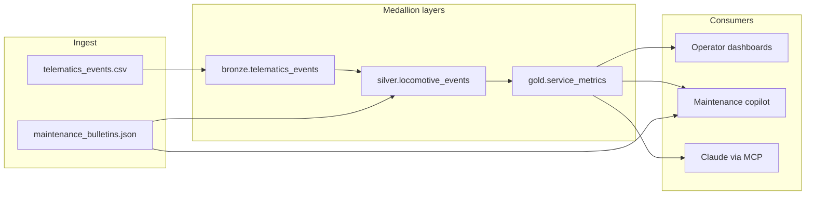
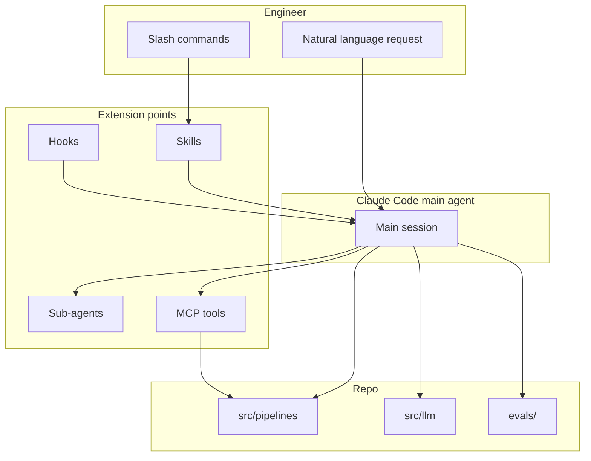
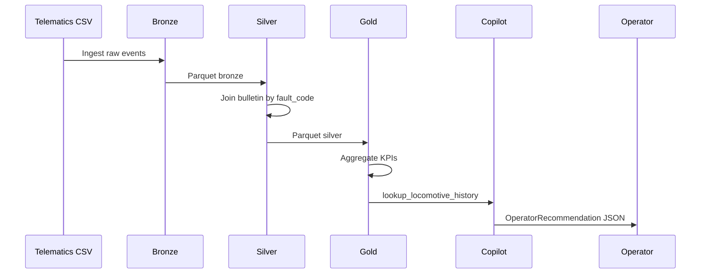

# Architecture

This document explains how the **domain layer** (telematics pipelines + copilot) and the **Claude Code harness** (Skills, agents, hooks, MCP) fit together, and when to use each primitive.

## System overview



### Medallion layers

| Layer | Module | Responsibility |
|-------|--------|----------------|
| **Bronze** | `src/pipelines/bronze_ingest.py` | Raw CSV ingest; add `_ingested_at`, `_source_file` metadata |
| **Silver** | `src/pipelines/silver_transform.py` | Clean types, dedupe on `event_id`, join maintenance bulletins by `fault_code` |
| **Gold** | `src/pipelines/gold_service_metrics.py` | Aggregate KPIs per locomotive/route/date; set `recommended_review` flag |

In Databricks, each layer would be a scheduled Job writing to a Delta table. This repo uses local parquet under `data/bronze|silver|gold/` (gitignored).

### Gold KPIs

| Column | Meaning |
|--------|---------|
| `fault_event_count` | Number of telematics events with a fault code |
| `avg_speed_mph` | Average speed over the aggregation window |
| `high_severity_fault_flag` | True if any joined bulletin had `severity: high` |
| `recommended_review` | True if faults exist or high-severity bulletin matched |

## Claude Code harness



## When to use what

Use this table to choose the right extension — the job posting cares that you understand the distinction, not that you maximize count.

| Primitive | Use when | Do not use when |
|-----------|----------|-----------------|
| **Skill** | A repeatable multi-step workflow with a clear trigger (e.g. "run eval and summarize") | One-off tasks or always-on rules |
| **Sub-agent** | Deep, isolated work needing a specialist persona (pipeline review, prompt review) | Simple shell commands or deterministic checks |
| **Hook** | Must-hold rules that must run every time (block secrets, lint after edit) | Optional guidance or exploratory tasks |
| **MCP** | Claude needs live access to structured data (schemas, sample rows) | Logic that belongs in Python application code |
| **CLAUDE.md** | Stable facts: directory map, conventions, commands | Long procedural workflows (use Skills instead) |
| **settings.json** | Permissions and hook registration shared with the team | Secrets (use `.env` / `settings.local.json`) |

### Skills in this repo

| Skill | Invoked as | Loads when |
|-------|------------|------------|
| `databricks-pipeline` | `/databricks-pipeline` | Adding or reviewing pipeline code |
| `prompt-eval` | `/prompt-eval` | Before shipping copilot prompt changes |
| `maintenance-rag` | `/maintenance-rag` | Adding maintenance bulletins to the knowledge base |

Skills load **on demand** — their bodies do not consume context until invoked.

### Sub-agents in this repo

| Agent | Tools | Purpose |
|-------|-------|---------|
| `pipeline-reviewer` | Read, Grep, Glob, Bash | Medallion and hygiene review after pipeline edits |
| `prompt-engineer` | Read, Grep, Glob | Structured output and eval coverage review |

Sub-agents run in **isolated context** and return a summary to the main agent.

### Hooks in this repo

| Event | Script | Behavior |
|-------|--------|----------|
| `PreToolUse` (Write/Edit) | `block-secrets.sh` | Deny if content matches API key / token patterns |
| `PostToolUse` (Write/Edit, `*.py`) | `lint-python.sh` | Run ruff or py_compile on edited Python files |

Hooks are **deterministic** — they enforce policy without model judgment.

### MCP: telematics-catalog

Registered in [`.mcp.json`](.mcp.json). Tools:

| Tool | Description |
|------|-------------|
| `list_tables` | Returns bronze/silver/gold table names |
| `describe_table` | Column list and layer metadata |
| `sample_rows` | Up to N rows from parquet (read-only) |

MCP bridges Claude and the **data catalog** — the same role Unity Catalog plays in production.

## Data flow: fault to operator action



The copilot returns structured output (`OperatorRecommendation` in `src/llm/schemas.py`):

- `severity`, `summary`, `recommended_action`, `confidence`

Mock mode produces deterministic output for reviewers without an API key.

## Eval harness

`evals/prompt_eval.py` runs cases from `evals/golden_set.json` and reports pass rate.

```
Input: locomotive_id
Output: OperatorRecommendation
Checks: severity in allowed set, action contains expected keywords
```

In production this would gate prompt deployments in CI — here it demonstrates the pattern locally.

## Security model

| Asset | Location | Committed? |
|-------|----------|------------|
| Team hooks + permissions | `.claude/settings.json` | Yes |
| API keys | `.env`, `.claude/settings.local.json` | No (gitignored) |
| Example local settings | `.claude/settings.local.json.example` | Yes (placeholder only) |
| Pipeline outputs | `data/bronze|silver|gold/` | No (gitignored) |

The `block-secrets` hook provides a second line of defense against accidental key commits during AI-assisted edits.

## Production mapping summary

| This repo | Production (Databricks/Azure) |
|-----------|-------------------------------|
| `pandas` + parquet | PySpark + Delta Lake |
| `data/sample/*.csv` | ADLS bronze paths / Auto Loader |
| JSON bulletins | Vector index + document store |
| Local MCP catalog | Unity Catalog MCP or metadata API |
| `evals/` in mock mode | CI eval job + prompt registry |
| `.claude/` in git | Shared team Claude Code config in Azure DevOps repo |
