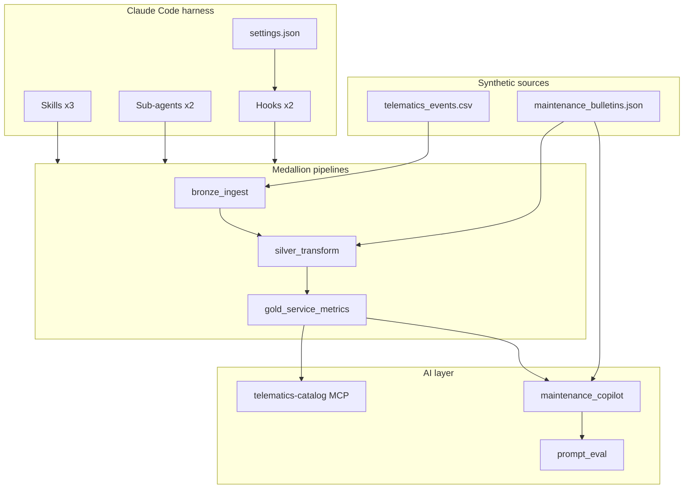

# Rail Service Analytics — Claude Code Portfolio

Synthetic telematics → medallion pipelines → maintenance copilot, with Claude Code Skills, sub-agents, hooks, and MCP.

> **Disclaimer:** All data in this repository is synthetic, used for demonstration purposes.

## Problem statement

Rail Service Analytics teams ingest locomotive telematics, enrich it with maintenance knowledge, and surface KPIs so operators can act on faults quickly. This repo shows how I would combine **Databricks-style medallion pipelines**, **LLM copilots**, and **Claude Code as an engineering partner** to accelerate that work — using local Python mocks instead of a live Azure/Databricks tenant.

## Architecture



See [ARCHITECTURE.md](ARCHITECTURE.md) for design rationale and when to use each Claude Code primitive.

## Claude Code components

| Component | Path | Why it exists |
|-----------|------|---------------|
| **Skill** `/databricks-pipeline` | [`.claude/skills/databricks-pipeline/SKILL.md`](.claude/skills/databricks-pipeline/SKILL.md) | Repeatable checklist for extending bronze/silver/gold pipeline code |
| **Skill** `/prompt-eval` | [`.claude/skills/prompt-eval/SKILL.md`](.claude/skills/prompt-eval/SKILL.md) | Runs the eval harness and reports pass rate before shipping prompt changes |
| **Skill** `/maintenance-rag` | [`.claude/skills/maintenance-rag/SKILL.md`](.claude/skills/maintenance-rag/SKILL.md) | Workflow to add a maintenance bulletin and re-validate copilot output |
| **Sub-agent** `pipeline-reviewer` | [`.claude/agents/pipeline-reviewer.md`](.claude/agents/pipeline-reviewer.md) | Delegated review of medallion boundaries, idempotency, and test coverage |
| **Sub-agent** `prompt-engineer` | [`.claude/agents/prompt-engineer.md`](.claude/agents/prompt-engineer.md) | Delegated review of structured output, eval coverage, and cost governance |
| **Hook** `block-secrets.sh` | [`.claude/hooks/block-secrets.sh`](.claude/hooks/block-secrets.sh) | PreToolUse: denies writes containing API keys or token patterns |
| **Hook** `lint-python.sh` | [`.claude/hooks/lint-python.sh`](.claude/hooks/lint-python.sh) | PostToolUse: runs ruff or py_compile after Python file edits |
| **Settings** | [`.claude/settings.json`](.claude/settings.json) | Team permissions, hook wiring, deny rules for secret files |
| **MCP server** `telematics-catalog` | [`.mcp.json`](.mcp.json) + [`catalog_mcp/telematics_catalog/server.py`](catalog_mcp/telematics_catalog/server.py) | Exposes table catalog and sample rows so Claude can query schema without guessing |
| **Project memory** | [`CLAUDE.md`](CLAUDE.md) | Always-on repo context, commands, and medallion conventions |

## Application code (domain layer)

| Path | Purpose |
|------|---------|
| `src/pipelines/` | Bronze / silver / gold Python pipelines (local mock of Databricks Jobs) |
| `src/llm/maintenance_copilot.py` | Claude API copilot with structured output + mock mode |
| `evals/prompt_eval.py` | Golden-set evaluation harness |
| `data/sample/` | Synthetic telematics CSV and maintenance bulletins |
| `tests/test_pipelines.py` | Pytest coverage for pipeline transforms |

## Quick start

```bash
git clone https://github.com/<you>/claude-rail-service-analytics.git
cd claude-rail-service-analytics

python3 -m venv .venv
source .venv/bin/activate
pip install -e ".[dev]"

# Run medallion pipelines (writes data/bronze|silver|gold/)
python -m src.pipelines.run_all

# Tests
pytest -q

# Copilot (mock — no API key)
python -m src.llm.maintenance_copilot LOC-4406 --mock

# Prompt evaluation
python evals/prompt_eval.py --mock
```

Optional live copilot (requires Anthropic API key):

```bash
cp .env.example .env
# edit .env and set ANTHROPIC_API_KEY
python -m src.llm.maintenance_copilot LOC-4406
python evals/prompt_eval.py --live
```

### Claude Code CLI

If you have [Claude Code](https://code.claude.com/) installed:

```bash
cd claude-rail-service-analytics
claude
# Try: /prompt-eval, /databricks-pipeline, or delegate to pipeline-reviewer
```

MCP server config is in [`.mcp.json`](.mcp.json). Run pipelines first so the catalog has parquet files to sample.

## 5-minute demo script

Full walkthrough: [docs/demo-walkthrough.md](docs/demo-walkthrough.md)

1. Run pipelines and show gold `recommended_review` KPIs
2. Invoke `/prompt-eval` or run eval script — show pass rate
3. Run maintenance copilot in mock mode for a faulting locomotive
4. Use MCP `list_tables` / `sample_rows` on `gold.service_metrics`
5. Show a Skill, sub-agent, and hook in `.claude/`

## What this would look like in production

On a real Databricks/Azure stack for Service Analytics:

- Pipelines become **PySpark jobs** writing to **Delta Lake** on ADLS (bronze/silver/gold tables)
- MCP connects to **Unity Catalog** or a metadata API instead of local parquet
- Copilot uses **Vector Search** over maintenance bulletins with `fault_code` filters
- Eval harness runs in **CI** before prompt deployment; static bulletin context uses **prompt caching**
- Hooks enforce the same secret-blocking and lint rules in the team's shared `.claude/settings.json`

## Limits of this demo

- No real Databricks, Azure, or telematics feed connections
- RAG is JSON + fault-code matching, not embeddings
- MCP reads local files only
- Eval golden set is small (3 cases) by design — quality over volume per the job posting guidance

## License

MIT (or specify your preference when publishing)
